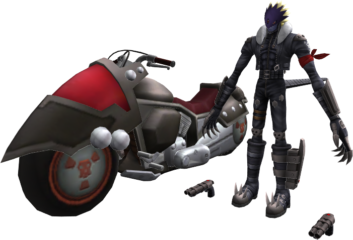
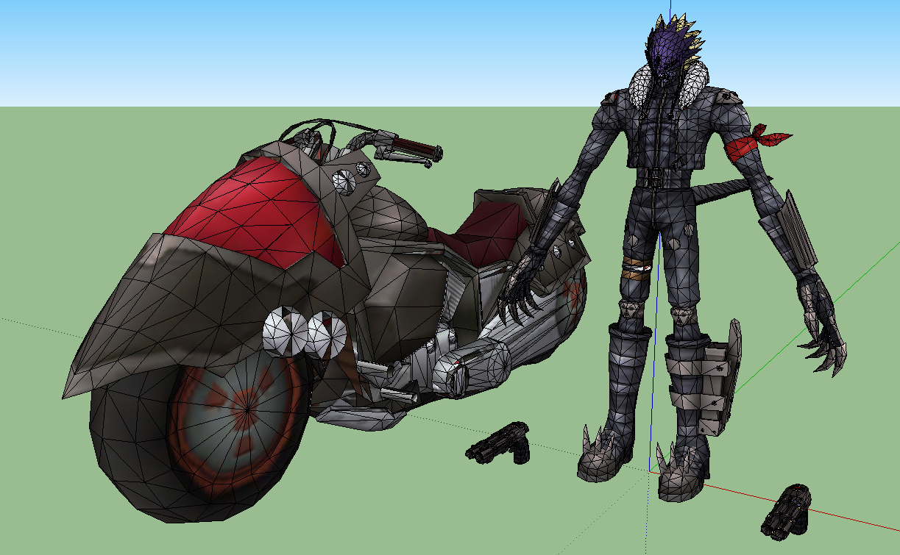

CSGeom
======
CSGeom is an experimental model viewer and exporter for .geom model files from Digimon Story: Cyber Sleuth. It is written in C# and based on the .NET Framework.

Requirements
============
* General
 * [.NET Framework 4.5](http://www.microsoft.com/en-US/download/details.aspx?id=30653)
* Compilation
 * Cobalt (OpenGL helper library; source code not yet available, sorry!)
 * Visual Studio Community 2013 (or higher)
* Usage
 * Converted *.pvr texture files (use [GXTConvert](https://github.com/xdanieldzd/GXTConvert))
 * *.geom files to view/export

Screenshots
===========

 
Acknowledgements
================
* Initial format notes by Toastline on [VG Resource](http://www.vg-resource.com/)
* Testing and sample files by [Ehm2k](https://twitter.com/Ehm2k)
